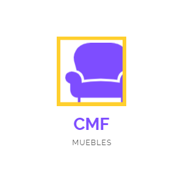

# Proyecto: E-commerce Fernandez

El proyecto consiste en el desarrollo de un e-commerce para la venta de muebles, realizado como proyecto final del curso de React de CoderHouse

## Tabla de Contenidos

1. [Instalación](#instalación)
2. [Uso](#uso)

## Instalación

Instrucciones sobre cómo instalar y configurar el proyecto localmente.

```bash
# Clonar el repositorio
git clone https://github.com/Carifer/Ecommerce-Fernandez.git

# Entrar al directorio del proyecto
cd ecommerce-fernandez

# Instalar dependencias
npm install @mui/material @emotion/react @emotion/

npm install @fontsource/roboto

npm install @mui/icons-material

npm install sweetalert2

npm i yup

```

## Uso

Ejemplos y casos de uso del proyecto.

```bash
# Ejemplo de cómo ejecutar el proyecto
npm run dev
```

Se muestra la pantalla principal del sitio:
